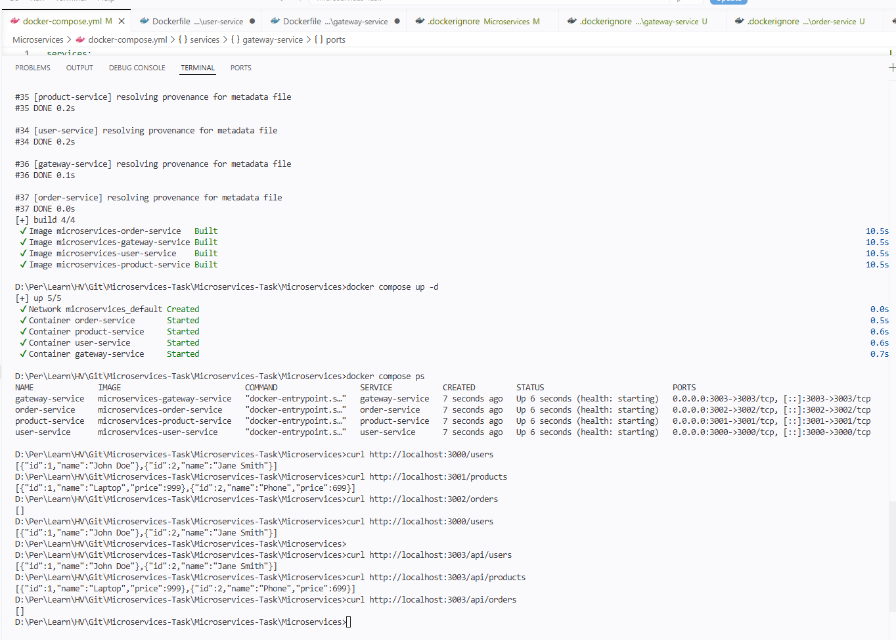
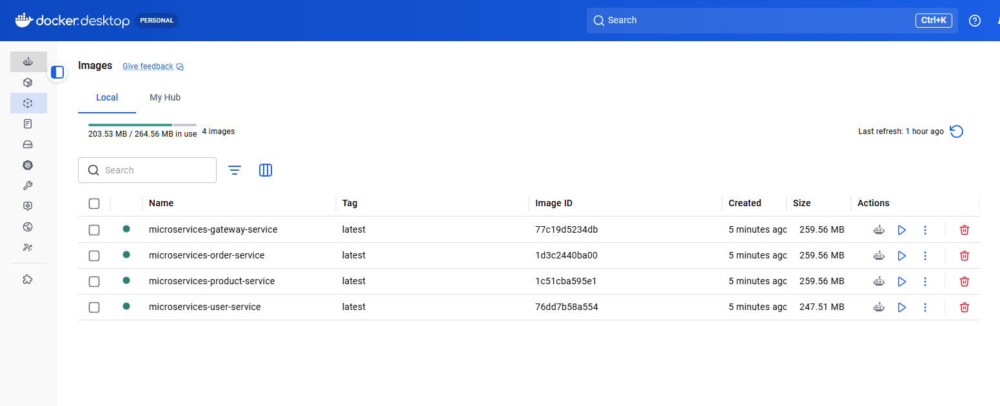
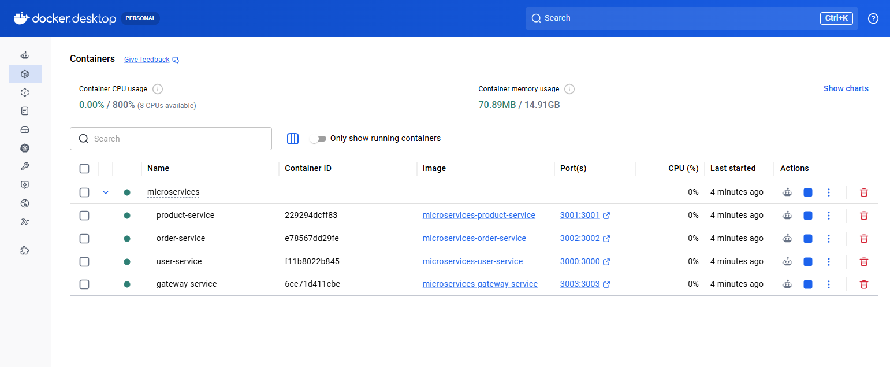

# Microservices-Task

## Overview
This document provides details on testing various services after running the `docker-compose` file. These services include User, Product, Order, and Gateway Services. Each service has its own endpoints for testing purposes.

---

## Services and Endpoints

### **User Service**
- **Base URL:** `http://localhost:3000`
- **Endpoints:**
  - **List Users:**  
    ```
    curl http://localhost:3000/users
    ```
    Or open in your browser: [http://localhost:3000/users](http://localhost:3000/users)

---

### **Product Service**
- **Base URL:** `http://localhost:3001`
- **Endpoints:**
  - **List Products:**  
    ```
    curl http://localhost:3001/products
    ```
    Or open in your browser: [http://localhost:3001/products](http://localhost:3001/products)

---

### **Order Service**
- **Base URL:** `http://localhost:3002`
- **Endpoints:**
  - **List Orders:**  
    ```
    curl http://localhost:3002/orders
    ```
    Or open in your browser: [http://localhost:3002/orders](http://localhost:3002/orders)

---

### **Gateway Service**
- **Base URL:** `http://localhost:3003/api`
- **Endpoints:**
  - **Users:**  
    ```
    curl http://localhost:3003/api/users
    ```
  - **Products:**  
    ```
    curl http://localhost:3003/api/products
    ```
  - **Orders:**  
    ```
    curl http://localhost:3003/api/orders
    ```

---

## Instructions
1. Start all services using the `docker-compose` file:
   ```
   docker-compose up
   ```
2. Once the services are running, use the above endpoints to verify the functionality.

Happy testing!

🔹🔹🔹🔹🔹🔹🔹🔹🔹🔹🔹🔹🔹🔹🔹🔹🔹🔹🔹🔹🔹🔹🔹🔹🔹🔹🔹🔹🔹🔹🔹🔹🔹🔹🔹🔹🔹🔹🔹🔹
# 🎯 Results:
🔹🔹🔹🔹🔹🔹🔹🔹🔹🔹🔹🔹🔹🔹🔹🔹🔹🔹🔹🔹🔹🔹🔹🔹🔹🔹🔹🔹🔹🔹🔹🔹🔹🔹🔹🔹🔹🔹🔹🔹
## 📌 Terminal Output:



## 📌 Docker Desktop Screenshot:





🔹🔹🔹🔹🔹🔹🔹🔹🔹🔹🔹🔹🔹🔹🔹🔹🔹🔹🔹🔹🔹🔹🔹🔹🔹🔹🔹🔹🔹🔹🔹🔹🔹🔹🔹🔹🔹🔹🔹🔹

## Summary

This project demonstrates a microservices-based application built with Node.js and containerized using Docker. The solution consists of User Service, Product Service, Order Service, and Gateway Service. Docker Compose is used to orchestrate all services and provide a consistent deployment experience.

## Docker Best Practices Implemented

- Containerized all services using Docker.
- Used Docker Compose for service orchestration.
- Configured containers to run as a non-root user (`USER node`).
- Installed only production dependencies using `npm install --omit=dev`.
- Added `.dockerignore` to reduce image size and exclude unnecessary files.
- Configured automatic container restart using `restart: unless-stopped`.
- Utilized Docker networking for service-to-service communication.
- Supported environment variables for service endpoint configuration.
- Pinned Node.js image version for consistent and reproducible builds.
- Added health checks for service availability monitoring.

## Verification Performed

The following tests were successfully completed:

- Docker images built successfully.
- All containers started successfully.
- User Service endpoint verified.
- Product Service endpoint verified.
- Order Service endpoint verified.
- Gateway Service routing verified.
- Docker Compose networking verified.
- Source code committed and pushed to GitHub.

## Notes

- Gateway Service acts as the single entry point for all client requests.
- Docker Compose automatically creates a dedicated network for service communication.
- Service health can be monitored using Docker health checks.
- Separate `.dockerignore` files are recommended inside each service directory.
- A root `.dockerignore` can also be maintained for future repository-wide builds.